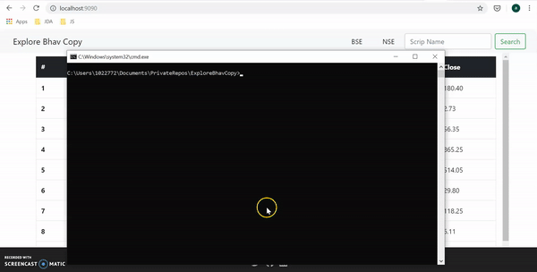

## Description
Webapp build using CherryPy which is used to download latest Bhav Copy from BSE website and store entries in Redis hashsets. Displays top 10 entries and has functionality for search by the scrip name.
## Getting started
You can run this using docker or by directly running the Cherrypy app and Redis server:
### 1. Using Docker
Make sure you have docker installed and its working fine.

1. Clone this repository.
2. Run docker-compose up from the root directory of this repository. This will pull the required images i.e. [Webapp image](https://hub.docker.com/r/anshulgera/bhav_copy_app) and [Redis image](https://hub.docker.com/_/redis) from [Docker hub](https://hub.docker.com/). This will start the app on your localhost at port 9090.
You can make your own changes and run 'docker-compose -f docker-compose-dev.yml up'.

    

